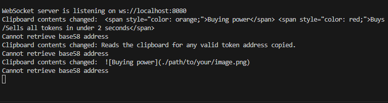
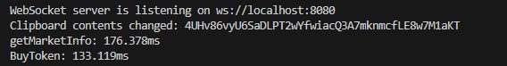
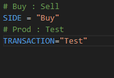
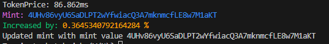
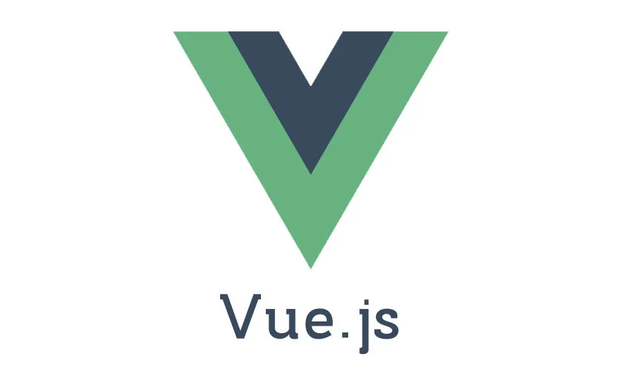
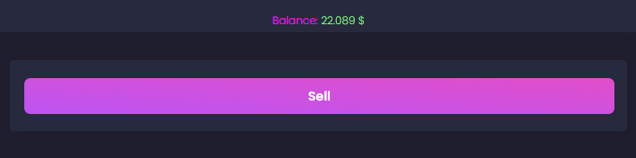
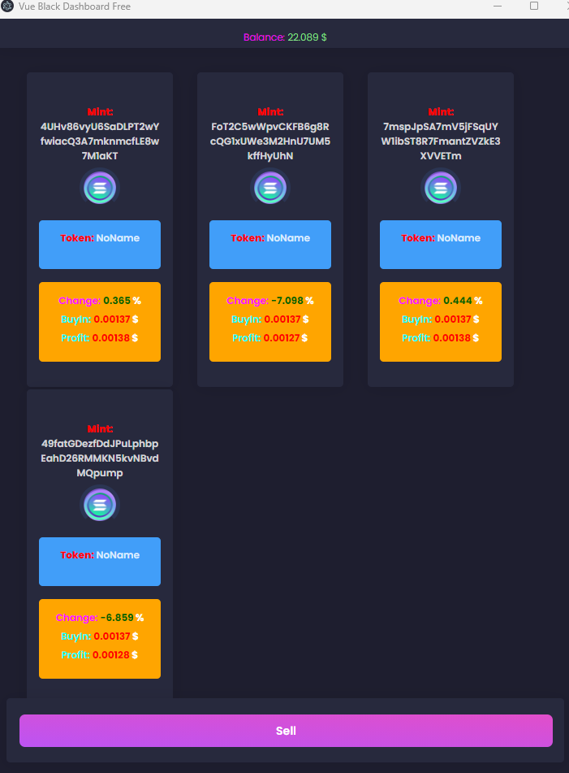

## ---------------Contact me---------------------------

telegram: [https://t.me/omagegambler](https://t.me/omagegambler)

Discord: [https://discord.gg/tZkCJGPp](https://discord.gg/tZkCJGPp)

## ---------------YellowFlex Solana Bot---------------------------

This YellowFlex Solana bot comes in a bundle of two packages.

 1. Solana QuickTrader - Very fast

 2. DEX aggregator + Interface built in vue.js and electron

## ---------------QuickTrader Specs ---------------------------

 Programming language Node.js

  Buying tecnique 1. Reads the clipboard for any valid token address copied.

  2. Buys instantly after the address is copied

  3. Allows you to check multiple telegram channels and evaluate the best token to buy instantly before everyone else

 Buying power Buys/Sells all tokens in under 2 seconds

 Features: Test/Prod capabilities

 Features: PnL on buy and sell

 Config 
1. HTTPRPC
2. Buy value
3. SLIPPAGE
4. FEE
5. SIDE
6. TRANSACTION

# ---------------DEX aggregator + Interface ---------------------------

 Programming language Vue.js + electron

 

 Features: Balance Shows wallet balance on top of the app: Changes when wallet change

 

 Features: Tokens Show all the tokens bought

 

 Features: Tokens interface 1. PnL

2. Change in %

3. Initial value $

4. Profit from initial value $

5. Mint token name: 

6. Mint address